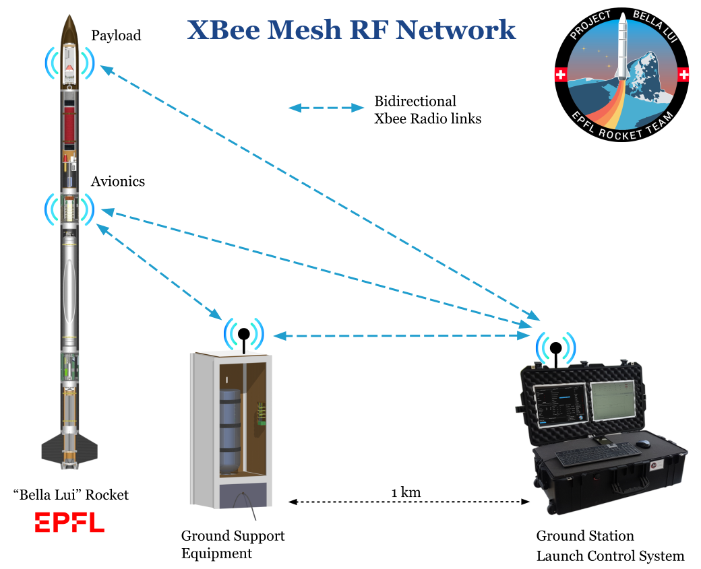
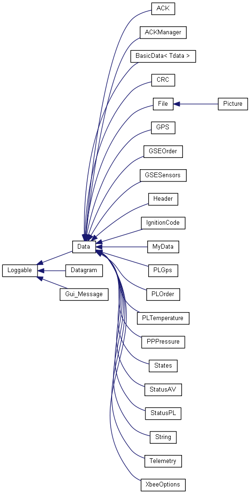
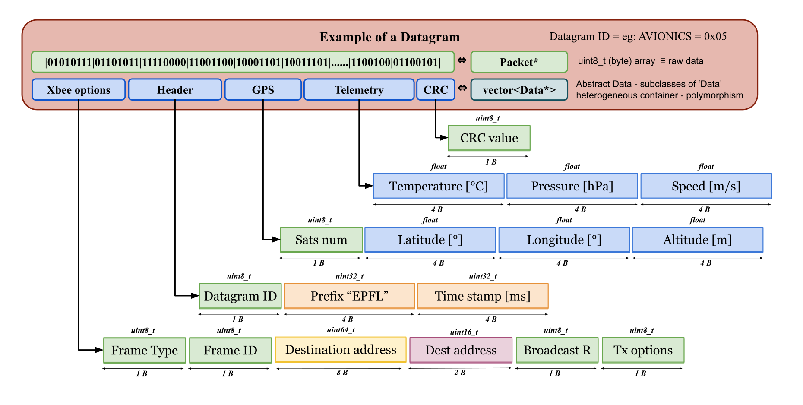

[](https://epflrocketteam.ch/fr/)

# EPFL Rocket Team - <em>Bella Lui Project 2020</em>

-----------------------------------------------------------------
## Table of Contents
1. [Abstract](#abstract)
2. [Repository organization tree](#repository-organization-tree)
3. [GST system diagram](#ground-station-system-diagram)
4. [Prerequisites](#prerequisites)
5. [Configure the XBee](#configure-the-xbee)
6. [Building software](#building-software)
7. [Running the tests](#running-the-tests)
8. [Information](#information)
9. [Appendix](#appendix)  
    9.1 [Datagrams description](#Datagrams-description)  
    9.2 [Tutorials](#tutorial-1--create-a-new-datagram)
-----------------------------------------------------------------
## Abstract
### Project purpose 
The EPFL Rocket Team association will be participating in the 10’000 feet 
SRAD Hybrid Engine category of the 2020 Spaceport America Cup, which will be held 
from June 16th to 20th.  
For more information, visit https://epflrocketteam.ch/fr/ :rocket:

### Description
This repository represent the software of the <b>Ground Segment subsystem</b>.
The main objective is to check that the mission is proceeding correctly via a 
two-way radio link with the other rocket subsystems. 
To do this, the ground station collects data from other subsystems (Avionics, Payload) 
in order to control the smooth running and also acts by sending radio commands to the 
Ground Support Equipment (GSE) in order to manage the <b>ignition</b> of the rocket.  
Therefore, the software is composed of a part that manages the radio communication,
 i.e. reading and writing radio packets correctly according to a specific protocol.
In addition, the user interaction part is established using a graphical user interface 
designed with Qt.  
This C++ software will run on a Raspberry Pi 4 located in the "Ground Station case". 
Radio communication is established using XBee RF modems (868 MHz in CH and 915 MHz in USA).

### Radio Network


### Subsystem requirements
Avionics
- [X] Display telemetry, GPS, status data on the GUI

GSE + Propulsion
- [X] Manage the ignition of the rocket (send correct code)
- [ ] Manage the filling of the rocket via radio (open - close N2O valves)

Payload
- [X] Manage the transmission of a picture each 10 min
- [X] Display some sensors data on the GUI


-----------------------------------------------------------------
## Repository organization tree
```
ERT2020GS
│   README.md
│   CmakeLists.txt              main cmake file calling cmake subfiles
│   autoBuild.sh                bash script to compile all this software   
└───Telecom
│   │   CMakeLists.txt          Telecom compilation config
│   └───Worker
│   │   │   Worker.h/cpp        Program main routine
│   │
│   └───Serializer
│   │   │   Packet.h/cpp        Serialize basic data types into a uint8_t buffer
│   │
│   └───DataHandler
│   │   │   DatagramTypes.h     DatagramID enum  
│   │   │   DataHandler.h/cpp   Manage Datagram at Tx & Rx
│   │   │   Datagram.h/cpp      Class that contains Data and a packet
│   │
│   └───DataStructures
│   │   │   Data.h              Abstact superclass that all DataStructures must inherit
│   │   │   Template.h/cpp      Example to follow when creating new Data structures
│   │   │                       // Then Data are sorted by substem
│   │   └───Basic               Basic generic class for simple data transmission
│   │   └───FrameInfo           Packet metadata required (XbeeOptions, Header, CRC)
│   │   └───File                Manage the transmission of a file
│   │   └───Avionics            Subsystem Data definition
│   │   └───GSE                 ""
│   │   └───Payload             ""
│   │   └───Propulsion          ""
│   │
│   └───RFmodem
│       │   RFmodem.h/cpp       Superclass for RF communication
│       │   Xbee.h/cpp          Manage serial communication with a packet
│       │   LoRa.h/cpp          Same but adapted for this RF modem
│       └───lib                 libraries for xbee and LoRa modem
│
└───RF-UI Interface             Allows the exchange of data between DataHandler & UI
│   │   connector.h/cpp         class containing an array<atomic<uint64_t>
│   │   ProtocolDefine.h        Define all indexes with an enum
│
└───UI
│   │   Guiwindow.h/cpp         backend of the GUI main window
│   │   SecondWindow.h/cpp      backend of the 2nd window
│   │   ui_form.h               file auto generated by Qt (GUI front end)
│   └───ui_file                 Qt Designer file from which ui_form.h can be generated
│   └───assets                  All the images, icons, etc for the GUI
│
└───Logger
│   │   Logger.h/cpp            Manage file logging
│   │   Loggable.h/cpp          Superclass of all loggable entity eg: Datagram
│   │   ...
│
└───src                         all available executables
│   │   ERT2020GS.cpp           Main program with GUI
│   │   PacketXTest.cpp         Test the Tx or Rx of a specified Datagram
│   │   AVsimulator.cpp         Simulate AV computer by sending multiple AV Datagram
│   │   TestDebug.cpp           Test only the xbee transmission without this software
│   
└───doc
    │   XbeeGS2020config.xpro   XCTU configuration file for xbee
    │   Doxyfile                Allows to generate Doxygen documention of this software
    └───html                    Result of doxygen documentation
    └───archive                 Old code
```
-----------------------------------------------------------------
## Ground Station system diagram
###  GST Hardware diagram


###  GST Software diagram

  
-----------------------------------------------------------------
## Prerequisites

- [x] Raspbian operating system installed

If you just buy a Raspberry Pi, please follow this part first [Installation of Raspbian](#installation-of-Raspbian)

First enable the SPI interface on your Pi with 
```console
sudo raspi-config
```
In `Interfacing options` 
- [x] SPI   
- [x] Serial

In order to have a correct building, you will need to install the following software

First open a terminal, and update your Raspberry Pi, then upgrade it
```console
sudo apt-get update
```
```console
sudo apt-get upgrade
```
Now we need to install cmake to compile the code
```console
sudo apt-get install cmake
```
Install git to be able to clone this git repository
```console
sudo apt-get install git
```
Then we need to install wiringpi to interact with the Raspberry Pi GPIO
```console
sudo apt-get install wiringpi
```
If you aren't working on the RPi, do this to be able to build on Linux :
```console
git clone https://github.com/WiringPi/WiringPi.git
```
```console
cd WiringPi && ./build
```
(You can delete the WiringPi folder after a correct building)  


### Install necessary Qt5 packages on Raspberry Pi 4

Run the following command as sudo in order to get needed packages before installing Qt5
```console
sudo apt-get install build-essential
```
Now you can refer to this tutorial:
Tutorial source : https://vitux.com/compiling-your-first-qt-program-in-ubuntu/

Or simply enter the following commands:  
To compile some Qt software
```console
sudo apt-get install qt5-default

sudo apt-get install qtmultimedia5-dev
```
To be able to play sounds
```console
sudo apt-get install libqt5multimedia5-plugins
```

Optional
```console
sudo apt-get install qtcreator
```
```console
sudo apt-get install qt5-doc qtbase5-examples qtbase5-doc-html 
```
### Install & configure your Pi to run a GPS (optional)

First follow this tutorial to [configure GPSD on your Raspberry Pi](https://wiki.dragino.com/index.php?title=Getting_GPS_to_work_on_Raspberry_Pi_3_Model_B)

Once this part achieved, install the library to use gpsd with c++
```console
sudo apt-get install libgps-dev
```
So at every boot you have to run this command to be 
able to read GPS data via gpsd
```console
 sudo gpsd /dev/ttyS0 -F /var/run/gpsd.sock
```
You can also add this command in the file ```/etc/rc.local```
in order to let the Raspberry Pi run this command automatically on boot

-----------------------------------------------------------------
## Configure the xbee
For a correct communication, if the xbee leaves the factory, you will have to flash
the same configurations profile as the other xbee modules using XCTU software.  
You can find this configuration profile in [doc/XbeeGS2020config.xpro](doc/XbeeGS2020config.xpro)  

-----------------------------------------------------------------
## Building software

First clone this GitHub repository in a folder using:
```console
git clone https://github.com/MorgesHAB/ERT2020GS.git
```
Move to the root folder of the project and run the bash to compile and build 
the executable files:
```console
sudo bash autoBuild.sh
```
If there are some errors :
* Open the main [CmakeLists.txt](CMakeLists.txt) and select your build configuration.
Maybe your Qt installation, or other get some errors.
```console
set(USE_GUI ON) # write ON or OFF 
set(USE_XBEE ON)
set(RUNNING_ON_RPI OFF) # OFF if you're working on your laptop
set(USE_SOUND OFF)
```
* First test that the cmake works correctly
```console
cd build
cmake ..
```
* Then use make and specify your target, eg an executable without Qt :
```console
make XbeeTest
make AVsimualtor
```

-----------------------------------------------------------------
## Running the tests
For this part, your working directory should be `.../ERT2020GS/build`. If this directory
doesn't exist, just type `mkdir build` from ERT2020GS.
First test that your xbee communication is working
```console
make XbeeTest
./XbeeTest Tx ttyUSB0
```


After having run the autoBuild.sh script correctly (no errors), many executable 
should have been created in a "build" folder. The main program calls "ERT2020GS" 
and is the one run on the Ground Station with a graphical user interface.
```console
./ERT2020GS
```
-----------------------------------------------------------------
## How to use the software
Create a `main.cpp` file in the src directory. Add the executable in the main CmakeLists.txt  
Add a Packet instance and your Transceiver instance 
and fill data on your packet.
The Packet::write(T t) method can take all the data that are 
of a size 8, 16 or 32 bits. You can override this method and adapt it to for 
example string or GPS data as it's already done. 
This is the same thing for the Packet::parse(T t) method.

This is an example for the transmitter part with Xbee as RF modem :
```cpp
#include "Packet.h"
#include "Xbee.h"

int main() {
    Xbee xbee;
    Packet packet;
    
    // fill your packet with some data
    packet.write(123);
    packet.write(float(34.56));
    packet.write('A');
    packet.write("Hello World");

    // Finally send your packet by RF
    xbee.send(packet);

    return 0;
}
```
-----------------------------------------------------------------
## Information

### Read doxygen documentation
Open this file in a web browser [doc/html/index.html](doc/html/index.html)  
For example you will find this class architecture diagram


-----------------------------------------------------------------
### Developed with
* Hardware
    * Raspberry Pi 4 - SDRAM 4Go - SD card 32 Go
    * 2 Xbee SX 868 MHz + PCBs + Antennas
    * The Ground Station case (screens, battery, mouse, keyboard, ...)

* Software
    * [CLion](https://www.jetbrains.com/cpp/) from JetBrains
    * Qt Designer for the graphical interface
    * XCTU for xbee configurations

Operating system NB : development on linux is easy.   
If you want to develop it on windows, I use [ubuntu](https://ubuntu.com/tutorials/tutorial-ubuntu-on-windows#1-overview)
application and Xserver for UI display redirection. Thus you can interact with the serial port
and so with the xbee.

-----------------------------------------------------------------
### Authors
* [Cem Keske](https://ch.linkedin.com/in/cem-keske-565363164) Mission UI & Logger
* [Stéphanie Lebrun](https://ch.linkedin.com/in/st%C3%A9phanie-lebrun-491695192) implementation of some Data structures
* [Lionel Isoz](https://github.com/MorgesHAB) RF telecommunication - xbee network - DataHandler

-----------------------------------------------------------------
### Acknowledgments
* [Clément Nussbaumer](https://github.com/clementnuss/gs_matterhorn) - ERT2018 GS, inspired this software
* [Alexandre Devienne](https://ch.linkedin.com/in/alexandre-devienne-ba4242127) - Xbee PCB & antennas
* [EPFL Rocket Team](https://epflrocketteam.ch/fr/)
* [Flaticon](https://www.flaticon.com/categories) for UI icon

-----------------------------------------------------------------
### Useful links
Documentations
* [XBee API mode](https://www.digi.com/resources/documentation/Digidocs/90001942-13/concepts/c_api_frame_structure.htm?tocpath=XBee%20API%20mode%7C_____2)
* [XBee Zigbee Mesh Kit](https://www.digi.com/resources/documentation/digidocs/pdfs/90001942-13.pdf)
* [XBee SX 868](https://www.digi.com/resources/documentation/digidocs/pdfs/90001538.pdf)

[](https://epflrocketteam.ch/fr/)


-----------------------------------------------------------------
# Appendix

## Datagrams description
Here is the communication protocol interface file that we share with other subsystems.  
Zoom in for better visibility (svg).  


-----------------------------------------------------------------
## Tutorial 1 : create a new Datagram

- [X] First, create a new DatagramID in [DatagramTypes.h](Telecom/DataHandler/DatagramTypes.h) 
and modify the getDatagramIDName() function.  
- [ ] Then go in the [constructor of DataHandler](Telecom/DataHandler/DataHandler.cpp) and create 
your new Datagram referred to as `dataHandler[MY_DATAGRAMID]`  by adding it all the 
Data you want.  
NB : the "add" method calling order defines the data order in your packet. 
```cpp
dataHandler[DatagramID]->add(new MyData);
```
For example, if my DatagramID is "AVIONIC_TEST"
```cpp
dataHandler[AVIONIC_TEST]->add(new BasicData<float>(DataType::TEMPERATURE_SENSOR));
dataHandler[AVIONIC_TEST]->add(new BasicData<float>(DataType::AV_ALTITUDE));
dataHandler[AVIONIC_TEST]->add(new BasicData<uint8_t>(DataType::AV_ORDER));
dataHandler[AVIONIC_TEST]->add(new String("Hello from space"));
dataHandler[AVIONIC_TEST]->add(new GPS);
//... and so on
```
You can add as much data as you want as long as the datagram (packet) size does not exceed 256 bytes.  

If your Datagram is quiet basic, that means it only need to stock the received data in
the RF-GUI connector or send a data located in that connector, you can use the generic 
"BasicData" class and only specify the connector index define in 
[ProtocolDefine.h](RF-UI-Interface/ProtocolDefine.h). Thus you will be able to process 
and print your data in the GUI program.

If your data is more complex, you have to create a new class that inherits of 
[Data](Telecom/DataStructures/Data.h) by following this [Template.h](Telecom/DataStructures/Template.h).

```cpp
// Pattern class
#include <Data.h>

class MyData : public Data {         // must inherite of the super class Data
public:
    void write(Packet& packet) override;
    void parse(Packet& packet) override;
    void print() const override;

    bool updateTx(std::shared_ptr<Connector> connector) override;
    bool updateRx(std::shared_ptr<Connector> connector) override;

private:
    float nbr;
    int x;
    char id;
    // ... Your class attributes
};
```
Then choose the data you want to transmit for example nbr & x  
So you just need to implement the write & parse function by adding   
Warning: the order is important.
```cpp
void MyData::write(Packet &packet) {
    packet.write(nbr);  // Use low level function to write bit to bit the RFpacket
    packet.write(x);
}
// Now in same same data order :
void MyData::parse(Packet &packet) {
    packet.parse(nbr);  // Use low level function to parse bit to bit the RFpacket
    packet.parse(x);
}
```

Finally, here is an example diagram of how to implement a new datagram



-----------------------------------------------------------------
## Tutorial 2 : change my RF modem
If you want to use other radio modules in addition of the xbee or LoRa, you will just 
need to adapt some part of the code.  

First create your new RF module class and made it inherit from the abstract class 
[RFmodem.h](Telecom/RFmodem/RFmodem.h). Then you have to override the send and
receive functions. You can have a look to [Xbee.cpp](Telecom/RFmodem/Xbee.cpp) as an example, 
but mainly, your send function must be able to transmit an array of uint8_t and your 
receive function to fill a uint8_t array with the received data.
Next, if you need, override also the getRSSI and isOpen functions.
If your new RF module requires some new library dependencies, be sure to adapt the 
[CMakeLists.txt](Telecom/CMakeLists.txt).

Finally you just need to change the RFmodem pointer with 
your new RF module instance in the mainRoutine of [Worker.cpp](Telecom/Worker/Worker.cpp).

-----------------------------------------------------------------
### Installation of Raspbian

Installation of Raspbian operating system on your Rapsberry Pi

Download the last version of Raspbian on (a file with .img extension): https://www.raspberrypi.org/downloads/raspbian/

Then write the img file on your SD card. You can use Win32DiskImager as software

Plug a keyboard & a mouse via USB port and a screen via HDMI port to your Raspberry Pi. 
Finally plug the 5V power.
