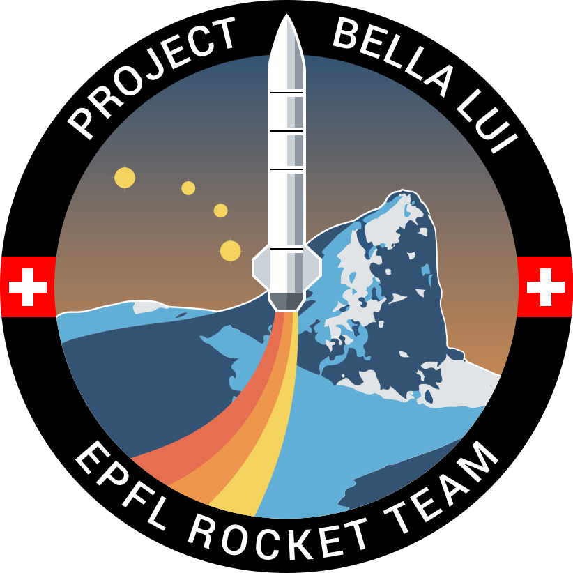

# EPFL Rocket Team Bella Lui Project

## Goal : Spaceport America Cup competition 

## Description
... coming

-----------------------------------------------------------------
## Installation of image magick
First you need to update & upgrade your Raspberry Pi
```
sudo apt-get update
sudo apt-get upgrade
```
Then we need to install the cmake to compile the code
```
sudo apt install cmake
```
-----------------------------------------------------------------
## Building


<p align="center"><em>Illustration of the two LoRa modem, one on a Raspberry Pi zero and one on a RPi 3B</em><br></p>
